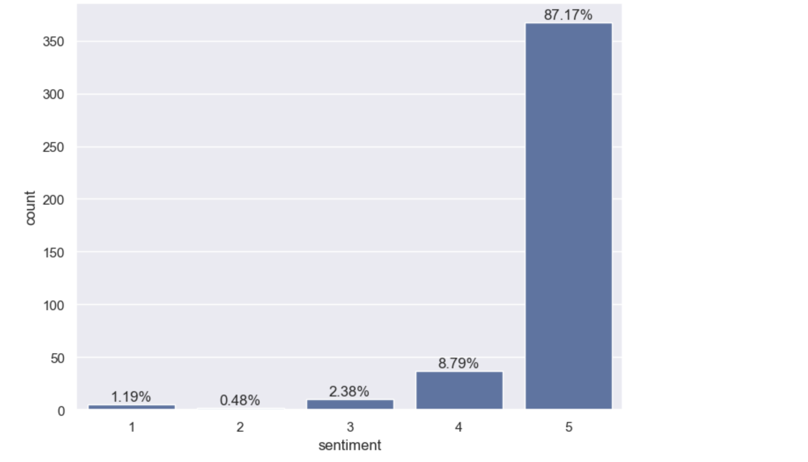
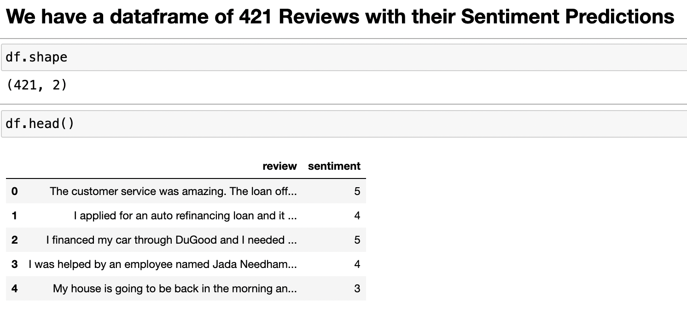
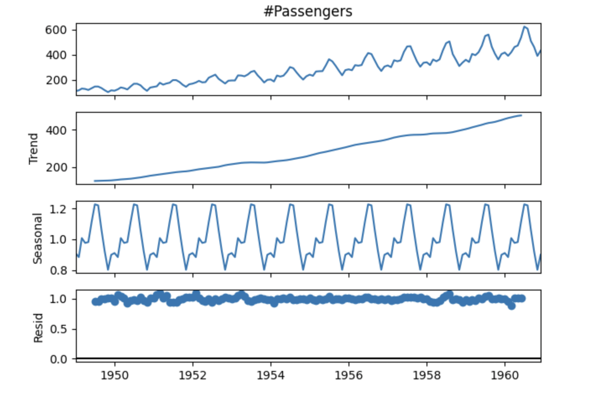
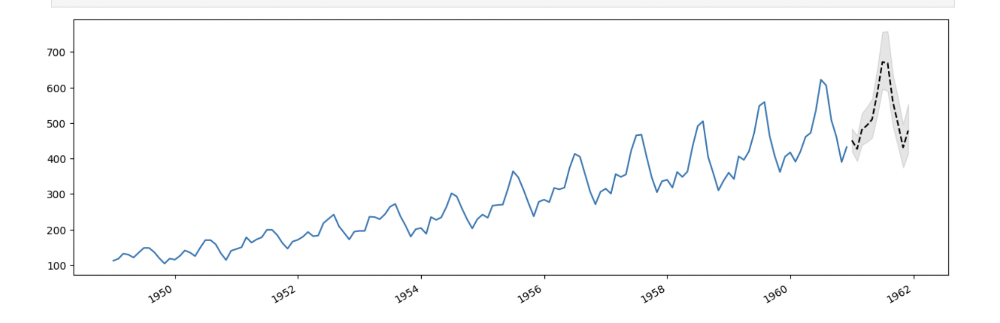
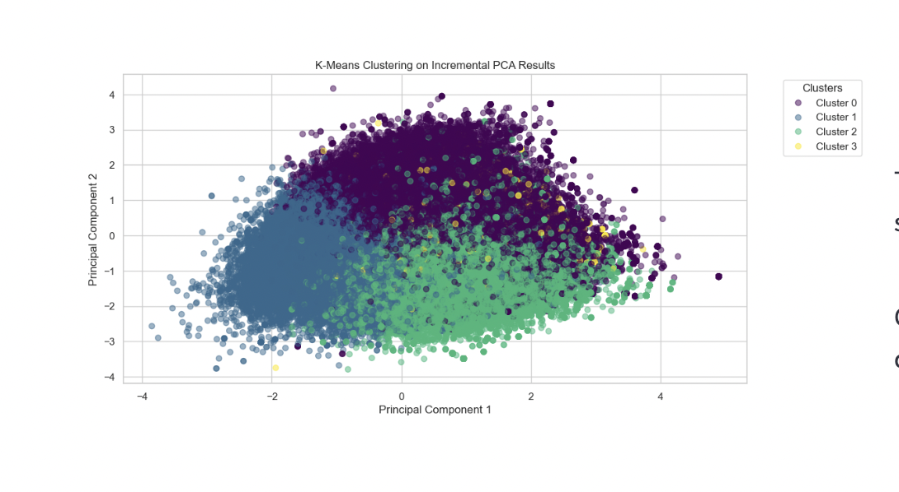
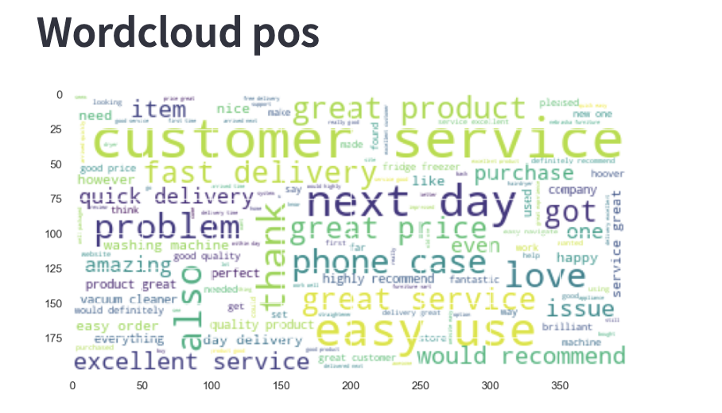
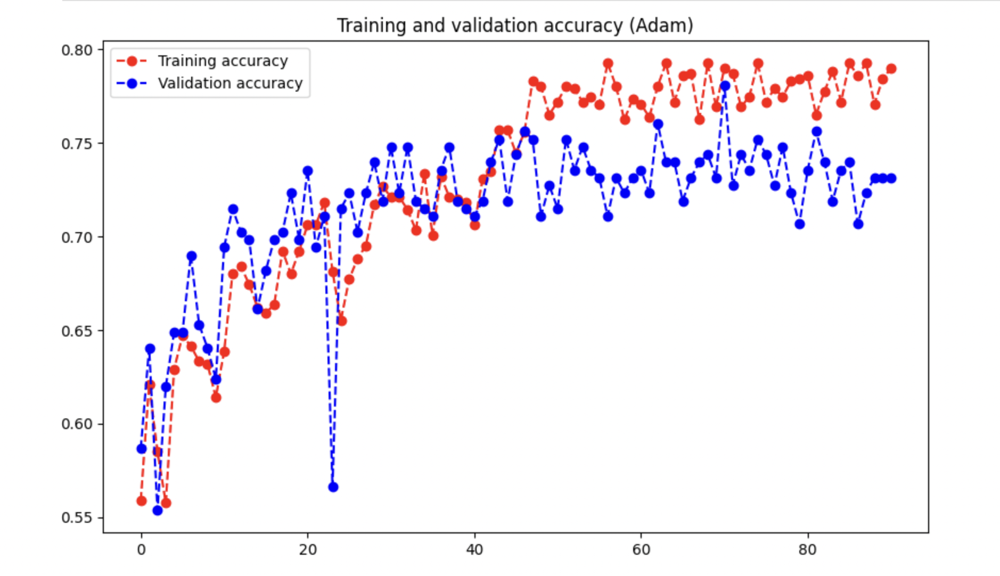

# About me
A flexible data scientist with broad analytical capabilities and a strong background in collaborative work. I have honed my skills by participating in a Data Science Certification Program, concentrating on NLP, Machine Learning, and Deep Learning, notably enhancing my expertise. My competencies span analytical thinking, mathematics, and statistics. Beyond my professional aptitude, I have consistently showcased my teamwork abilities as an integral team member.

## My Projects: 
### 1. Performing sentiment analysis from Trustpilot reviews of DoGood Credit Union DBank by using LLM- Transformer Model BERT
[Notebook](https://github.com/ayseljafar/BERT_sentiment_analysis/blob/main/Sentiment_BERT.ipynb)

### 2. Time Series Analysis using Sarimax models for prediction seasonality of aviation passengers.
[Notebook](https://github.com/ayseljafar/timeseries_passengers/blob/main/airpassengers.ipynb)

#### Predictions of the number of passengers according to SARIMAX Model for the year 1962

### 3.Customer Satisfaction from Trustpilot reviews
This project explored customer sentiment in Trustpilot reviews using a comprehensive toolbox that combined web scraping, machine learning, and Natural Language Processing (NLP) techniques.

[Streamlit_app](https://customer-satisfaction.streamlit.app/)
#### KMeans Clustering of PCA applied vectorized reviews to reduce dimensionality

#### Wordcloud generated from positive reviews

### 4. AI-vs-Real-Image-analysis
In this project, I used openCV and deep learning algorithms to generate a CNN model for predicting whether the images are AI-generated or real. Prediction Accuracy reaches up to 79% of the model there is no sign of overfitting and the model is successfully predicting between AI-generated and Real Art pictures.

[Notebook](https://github.com/ayseljafar/AI-vs-Real-Image-analysis/blob/main/AIvsRealAArt.ipynb)

### 5. I’m working on a churn detection project to estimate bank customers' subscriptions.

